# Lab 1: HTTP File Server with TCP Sockets

## Overview

This lab demonstrates a simple HTTP server implemented in Python using TCP sockets.

The server:
- Serves files from a specified directory.
- Supports **HTML, PNG, and PDF** files.
- Generates directory listings for **nested directories**.

A Python **client** can fetch files from the server and save them locally depending on the file type.
jj
---

## 1. Source Directory
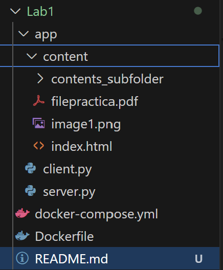

*The source directory contains:*
- `server.py` – the HTTP server script.
- `client.py` – the HTTP client script.
- `content/` – the folder served by the server:
  - `index.html` – HTML page.
  - `image1.png` – PNG image.
  - `filepractica.pdf` – PDF file.
  - `contents_subfolder/` – subdirectory with additional files.
- `docker-compose.yml` – Docker Compose file.
- `Dockerfile` – Dockerfile for the server.
- `README.md` – this report.


## 2. Docker Setup

### 2.1 Docker Compose and Dockerfile
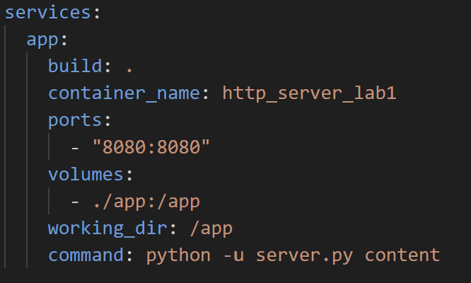

Docker Compose defines the container environment for the HTTP server, mapping port 8080 and mounting the app directory.

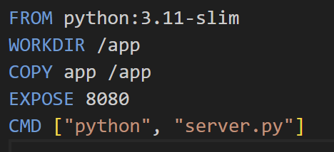

The Dockerfile creates a lightweight Python container, copies the server code into it, and exposes port 8080 for incoming connections.

### 2.2 Starting the Container


This command builds the image from the Dockerfile and starts the HTTP server container. The server begins listening on port 8080.


### 2.3 Running the Server Inside the Container

Inside the container, the HTTP server is started automatically with the following command located in the Docker Compose file:


This command runs the server script and specifies content as the directory to be served. The argument defines the root directory for the HTTP server.

## 3. Contents of the Served Directory

The HTTP server serves files from the content directory specified in the command.
The content directory contains HTML, PDF, PNG files, and the contents_subfolder.

`content/` directory

*Contains:*
- `index.html` – main HTML page
- `image1.png` – image referenced in the HTML file
- `filepractica.pdf` – sample PDF file

- `contents_subfolder/` – subdirectory with additional files


`contents_subfolder/` directory

*Contains:*

Additional files used to test subdirectory listing and file access.
- `dogphoto.png` - a basic image
- `GuidebookPoznan.pdf` - another pdf file

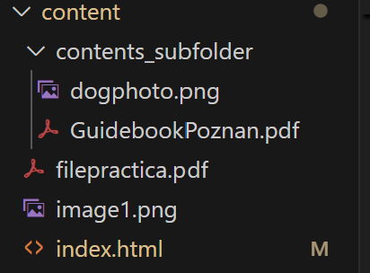


## 4. File Requests in the Browser

### 4.1 Non-existent File (404)

This test shows that the server correctly handles missing files.

Request in the browser:

```
http://localhost:8080/snakephoto.png
```

Browser result showing 404 Not Found text.


Printed in the docker terminal:

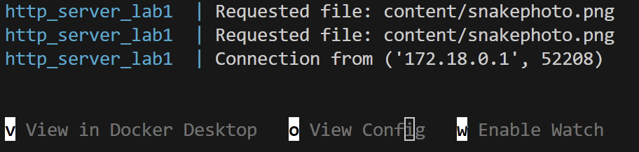


### 4.2 HTML File with Image
This test shows that the server correctly serves HTML pages and embedded images. The page references `image1.png` inside the content directory.

Request in the browser:
```
http://localhost:8080/index.html
```

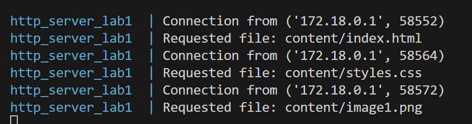


Browser result showing HTML page with embedded image:

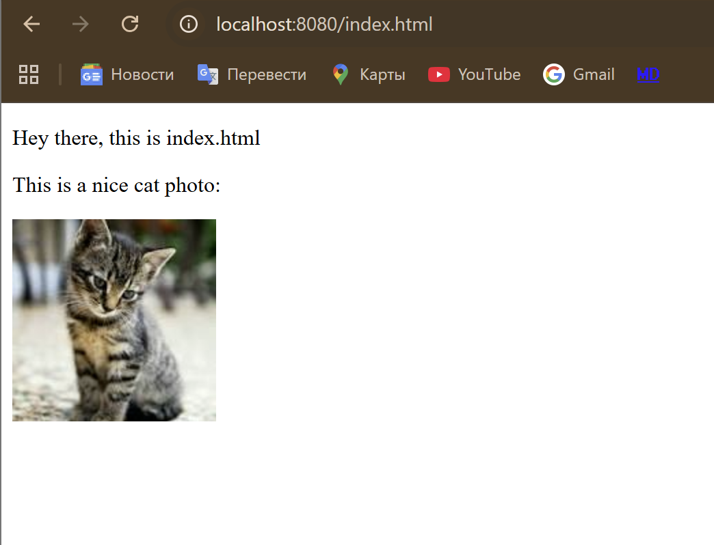

The HTML page is loaded successfully, and the referenced PNG image is displayed inside the page.


### 4.3 PDF File
This test shows that the server correctly serves PDF files. The file is requested and either displayed in the browser PDF viewer or triggers a download, depending on browser settings.

Request in the browser:

```
http://localhost:8080/filepractica.pdf
```


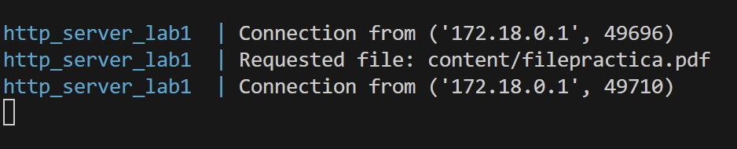

Browser result showing the PDF:

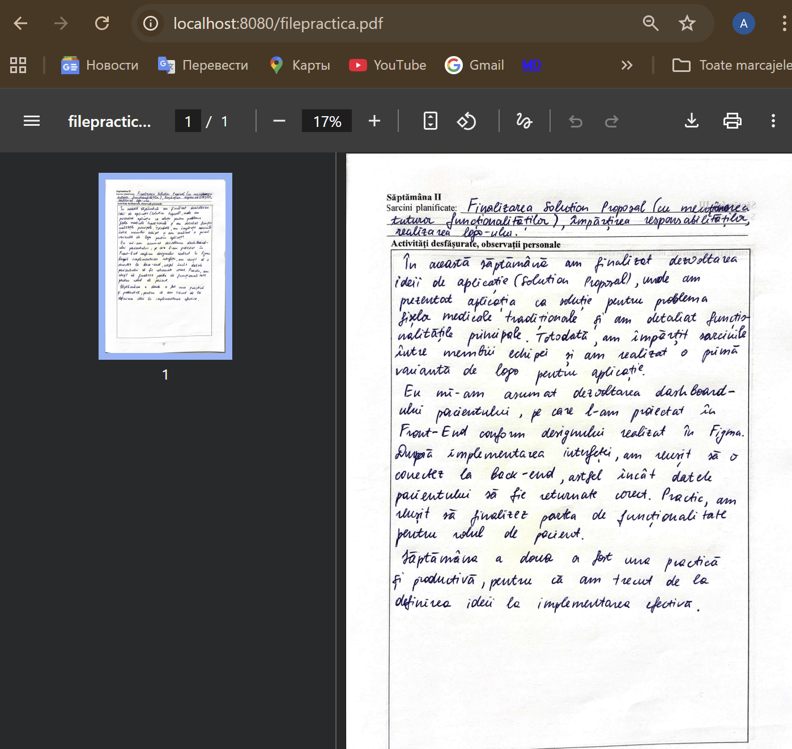


### 4.4 PNG File

This test shows that the server correctly serves image files. The PNG file is displayed directly in the browser.

Request in the browser:
```
http://localhost:8080/image1.png
```

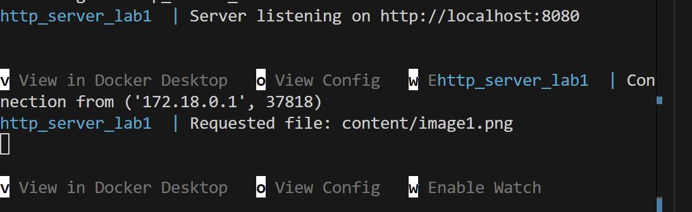

Browser result showing the PNG image:

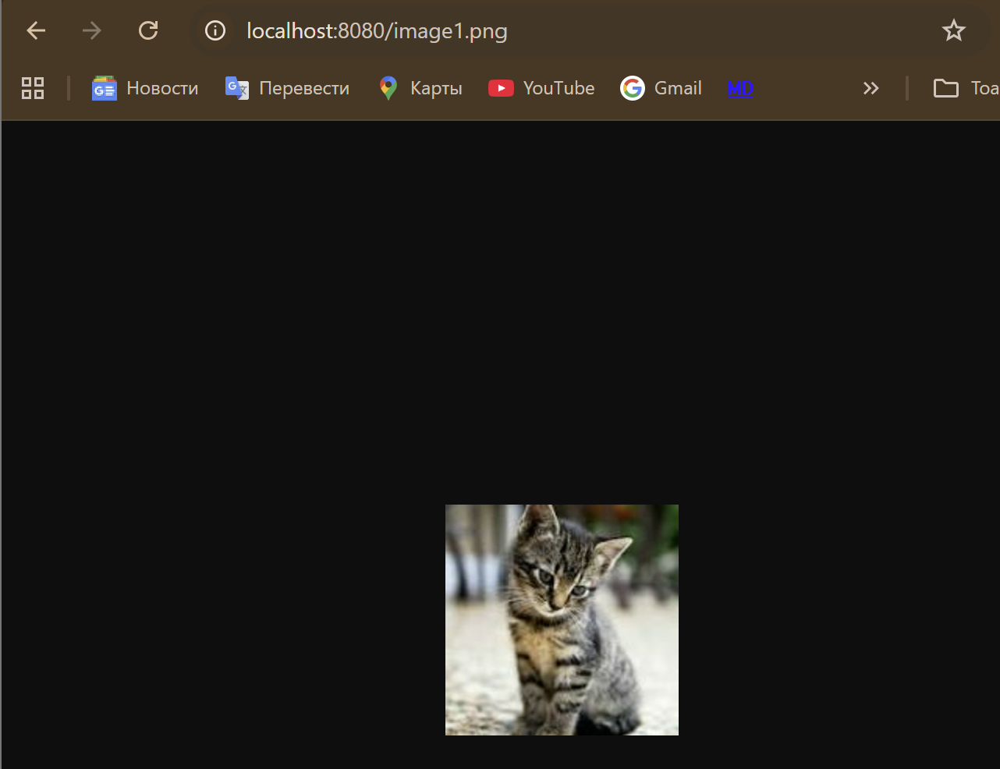

The PNG image is loaded successfully in the browser.


## 5. Python Client
The Python client can fetch files from the server and save them locally depending on the file type. HTML pages are printed, while PDFs and PNGs are saved in a specified directory.

## 5.1 Running the Client
Command to run the client:

```
 python client.py localhost 8080 /index.html ./downloads
 ```

 The client is executed with server host, port, requested file path, and local download directory as arguments.


## 5.2 Client Output

HTML page printed to the console:

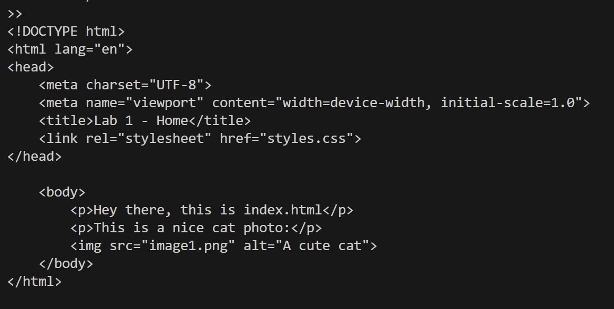

The HTML page body is printed directly to the console.

PDF and PNG files saved in the downloads directory:

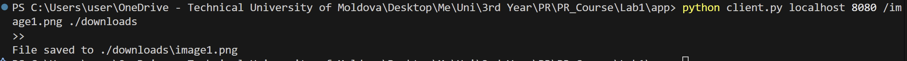

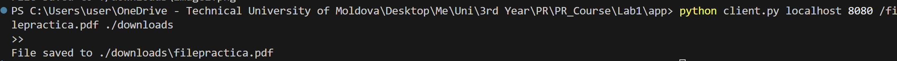


The PDF and PNG files are saved locally in the specified directory by the client.

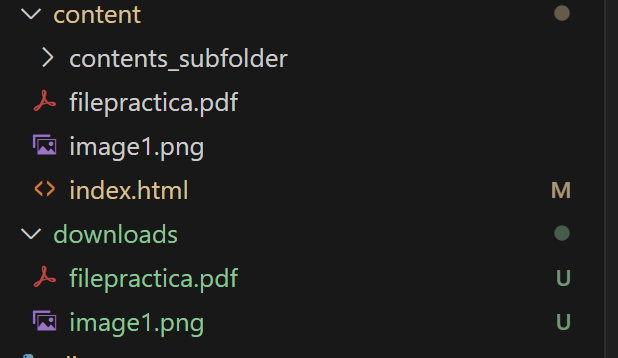


## 6. Directory Listing for Subdirectories
The server generates an HTML directory listing when a directory path is requested, allowing navigation and access to all files in a folder.

Request for subdirectory:


Generated directory listing page in browser:

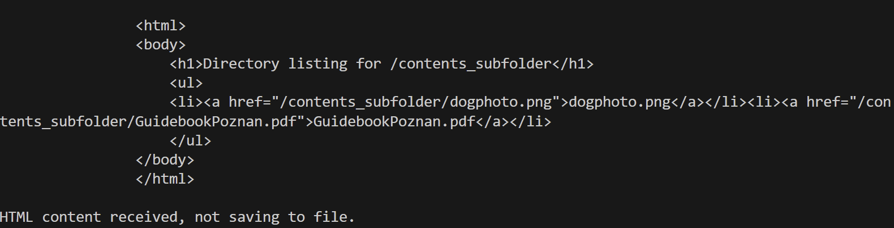

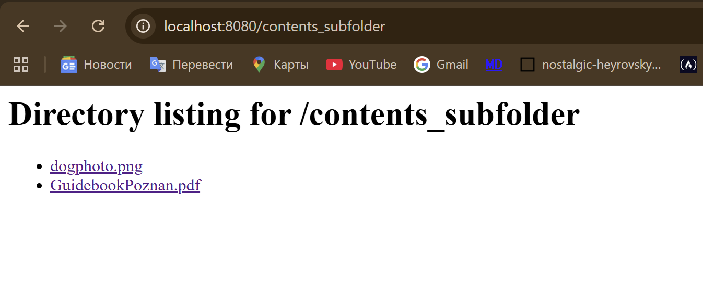


## 7. Conclusion

The HTTP server successfully serves HTML, PNG, and PDF files, generates directory listings for subfolders, and correctly handles 404 and unsupported file types. The Python client fetches files, prints HTML pages, and saves PNG/PDF files locally. All lab requirements are met, and the screenshots demonstrate that the server and client function as expected.