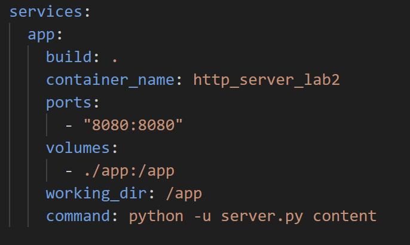
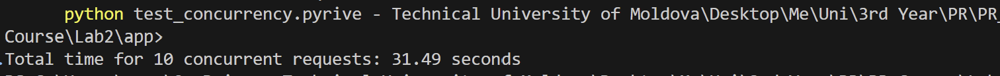
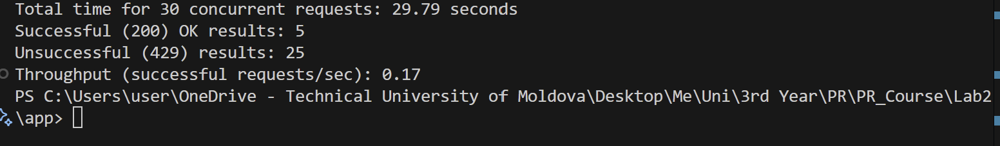
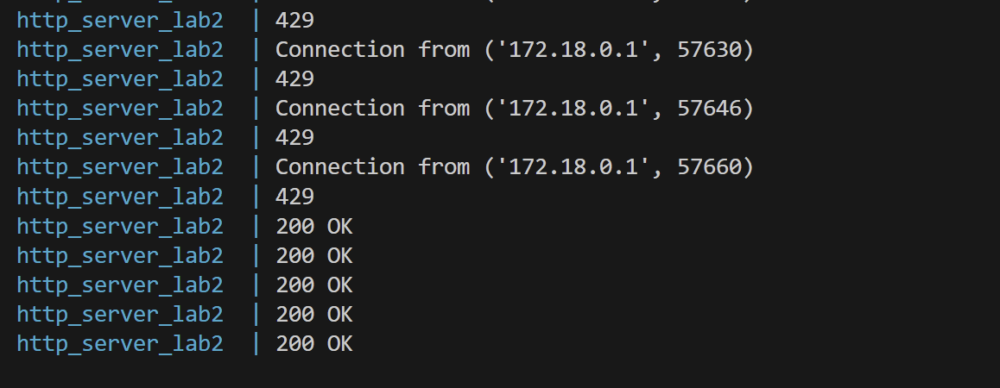

# Lab 2: Concurrent HTTP Server

## Overview

This lab extends the HTTP file server from Lab 1 to support concurrent (multithreaded) connections, a request counter with synchronization, and rate limiting per IP address.

The server:

- Handles multiple clients simultaneously using Python threads.

- Tracks the number of requests made to each file.

- Prevents race conditions using thread synchronization (locks).

- Limits clients to 5 requests per second using rate limiting.

Testing involved both local concurrent requests and access from a phone on the same network.

---

## 1. Source Directory


*The source directory contains:*
- `server.py` – the HTTP server script.
- `client.py` – the HTTP client script.
- `test_concurrency.py` – script to simulate multiple concurrent client requests.
- `content/` – folder served by the server (HTML, PNG, PDF files).
- `Dockerfile` – container definition.
- `docker-compose.yml` – configuration for automatic server startup.
- `README.md` – this report.


## 2. Docker Setup

The Docker configuration remains the same as in Lab 1, with only the container name changed.




## 3. Concurrent Request Handling

The multithreaded server creates a new thread for every connection:

```
thread = threading.Thread(target=handle_request, args=(connectionSocket, adr, content_dir))
thread.start()
```
This enables multiple clients to request files simultaneously.

To test this, the script test_concurrency.py creates 10 concurrent requests, each handled in a separate thread by the function request_file.
The script measures the time taken to complete all requests.

Results for multithreaded server:



Results for single-threaded server:


The multithreaded server handles requests much faster since multiple clients are served at the same time.


## 4. Request Counter and Synchronization

A dictionary requests_per_file keeps track of how many times each file was requested.
To test this, 6×5 concurrent requests were made for multiple files:

```
files = ["/filepractica.pdf", "/image1.png", "/index.html", "/contents_subfolder/dogphoto.png", "/contents_subfolder/GuidebookPoznan.pdf"] * 6
```

Naive Implementation (Without Lock)

```
  current_count = requests_per_file.get(requested_file, 0)
    ##forcing interleaving
    time.sleep(3)
    requests_per_file[requested_file] = current_count + 1
```

This version caused incorrect counts due to race conditions:


Synchronized Implementation (With Lock)

```
 with counter_lock:
        current_count = requests_per_file.get(requested_file, 0)
        ##forcing interleaving
        time.sleep(3)
        requests_per_file[requested_file] = current_count + 1
```

This approach ensures correct and consistent counts:


## 5. Rate limiting
The server tracks recent request timestamps per IP.
If more than 5 requests within 1 second, the server responds with:

```
HTTP/1.1 429 Too Many Requests
```

This prevents spammy clients from overloading the server.

When running test_concurrency.py with 30 concurrent requests (no delay), many were correctly blocked as spam:







## 6. Conclusion
This lab demonstrated how concurrency and synchronization can be applied to an HTTP server.
By introducing multithreading, the server became capable of handling multiple clients in parallel, significantly improving throughput.
However, concurrent access to shared data structures (like the request counter) required synchronization mechanisms such as locks to avoid race conditions.
Finally, implementing rate limiting added a layer of protection against excessive requests and ensured fair resource usage across clients.

