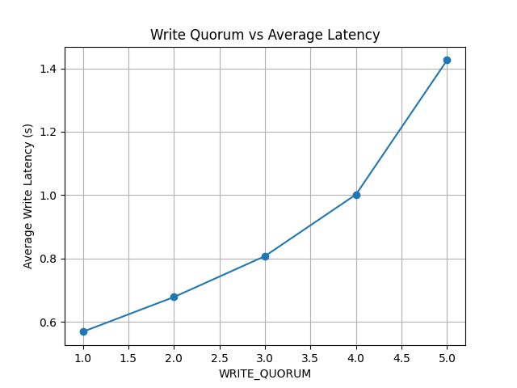

# Lab 4: Single-Leader Replication

## Overview

This lab implements a distributed key–value store with one leader and five followers.
Only the leader accepts write requests and replicates them to all followers using a semi-synchronous replication model.
The system uses HTTP + JSON, runs in Docker Compose, and includes:

- concurrent replication using Python threads

- random network delay simulation

- a configurable write quorum

- an integration test verifying replication

- a performance experiment using ~10K concurrent writes

- a consistency check across all replicas

---

## 1. Source Directory

*The source directory contains:*
- `leader.py` – leader server with replication and quorum logic
- `follower.py` – follower server storing replicated data
- `integration_test.py` – checks that followers match leader
- `performance_test.py` – runs 10K writes and plots latency
- `docker-compose.yml` – defines leader + 5 followers
- `Dockerfile` – container build configuration
- `requirements.txt` – dependencies
- `README.md` – this report


## 2. Docker Setup

All six nodes (1 leader + 5 followers) run inside Docker Compose.
Environment variables configure followers, quorum, minimum and maximum delay.

### Docker Compose File
```
version: "3.9"

services:
  leader:
    build: .
    container_name: leader
    command: python3 leader.py
    environment:
      ROLE: leader
      FOLLOWERS: follower1:5000,follower2:5000,follower3:5000,follower4:5000,follower5:5000
      WRITE_QUORUM: 2
      MIN_DELAY: 0.0001
      MAX_DELAY: 0.001

    ports:
      - "5000:5000"

  follower1:
    build: .
    container_name: follower1
    environment:
      ROLE: follower
      FOLLOWER_ID: 1
    command: ["python", "follower.py"]
    ports:
      - "5001:5000"  # host 5001 → container 5000

  follower2:
    build: .
    container_name: follower2
    environment:
      ROLE: follower
      FOLLOWER_ID: 2
    command: ["python", "follower.py"]
    ports:
      - "5002:5000"

  follower3:
    build: .
    container_name: follower3
    environment:
      ROLE: follower
      FOLLOWER_ID: 3
    command: ["python", "follower.py"]
    ports:
      - "5003:5000"

  follower4:
    build: .
    container_name: follower4
    environment:
      ROLE: follower
      FOLLOWER_ID: 4
    command: ["python", "follower.py"]
    ports:
      - "5004:5000"

  follower5:
    build: .
    container_name: follower5
    environment:
      ROLE: follower
      FOLLOWER_ID: 5
    command: ["python", "follower.py"]
    ports:
      - "5005:5000"
```

### Running the project:
```
docker compose build
```


## 3. Leader and Follower Servers

### Leader

The leader handles /write requests, stores the value locally, and replicates it concurrently to all followers.
The leader waits until the configured write quorum number of followers respond.

```
@app.route("/write", methods=["POST"])
def write():
    threads = []
    results = []

    data = request.get_json()
    key = data["key"]
    value = data["value"]
    quorum = data.get("quorum", DEFAULT_QUORUM)

    store[key] = value

    for follower in FOLLOWERS:
        t = threading.Thread(target=replicate_to_follower, args=(follower, key, value, results))
        t.start()
        threads.append(t)

    start_time = time.time()
    
    timeout = 2  # seconds
    while True:
        success = sum(1 for r in results if r)
        if success >= int(quorum):
            print("Quorum reached", flush=True)
            break
        if time.time() - start_time > timeout:
            return jsonify({"status": "failed", "success": success}), 500

    return jsonify({"status": "ok", "success": success}), 200


    def replicate_to_follower(follower, key, value, results):
    delay = random.uniform(MIN_DELAY, MAX_DELAY)
    time.sleep(delay)
    
    try:
        r = requests.post(f"http://{follower}/replicate", json={"key": key, "value": value})   
        with lock:
            results.append(r.status_code == 200)
    except:
        with lock:
            results.append(False)
```

### Followers

Each follower stores the key and returns "ok".

```
@app.route("/replicate", methods=["POST"])
def replicate():
    data = request.get_json()
    key = data["key"]
    value = data["value"]
    store[key] = value

    return jsonify({"status": "ok"})
```

## 4. Integration Test
The integration test writes one value to the leader and ensures all five followers match it:


```
r = requests.post(f"{LEADER}/write", json={"key": key, "value": value})   

for f in FOLLOWERS:
        fr = requests.get(f"{f}/read?key={key}")
        assert fr.status_code == 200
        assert fr.json()["value"] == value, f"Follower {f} does NOT have replicated data!"

print("✓ Replication integration test passed successfully!")

```

## 5. Performance Test (10K Writes)
To analyse how write quorum affects latency, I generated 10,000 write operations using 15 threads.
The write request also included the quorum value:

```
def write_one(key, value, quorum):
    start_time = time.time()
    r = requests.post(f"{LEADER}/write", json={"key": key, "value": value, "quorum": quorum})   
    end_time = time.time()
    latency = end_time - start_time

    with latencies_lock:
        latencies.append(latency)
```

For quorum values from 1 to 5, the performance test collected average latency.
After all runs, a plot was generated:



As expected, increasing the write quorum makes the write latency go up.

## 6. Consistency Check
After all writes finished, the script compared the leader’s values with each follower:
```
def check_replications():

    leader = {}
    per_follower_matches = {f: 0 for f in FOLLOWERS}
   

    for key in range(KEYS):
        r = requests.get(f"{LEADER}/read?key={key}")
        leader[str(key)] = r.json()["value"]

    for key in range(KEYS):
        for f in FOLLOWERS:
            fr = requests.get(f"{f}/read?key={key}")
            if fr.json()["value"] == leader[str(key)]:
                per_follower_matches[f] += 1
    
    print("\n=== Consistency Check Results ===")
    print("Keys:", KEYS)
    for f in FOLLOWERS:
        print("Follower", f, " matched keys: ", per_follower_matches[f], "/", KEYS)
          
```

Each follower successfully matched all the leader’s keys.
```
=== Consistency Check Results ===
Keys: 100
Follower http://localhost:5001  matched keys:  100 / 100
Follower http://localhost:5002  matched keys:  100 / 100
Follower http://localhost:5003  matched keys:  100 / 100
Follower http://localhost:5004  matched keys:  100 / 100
Follower http://localhost:5005  matched keys:  100 / 100
```

## 7. Conclusion
This lab implemented a functional distributed key–value store with single-leader replication.
The system supports concurrency, simulated network delay, and a configurable write quorum.
Integration testing confirmed correct replication, while performance testing showed how quorum settings affect write latency.
The consistency check verified that after all writes finished, all replicas matched the leader’s data.

The system satisfies all required functionality for Lab 4.
